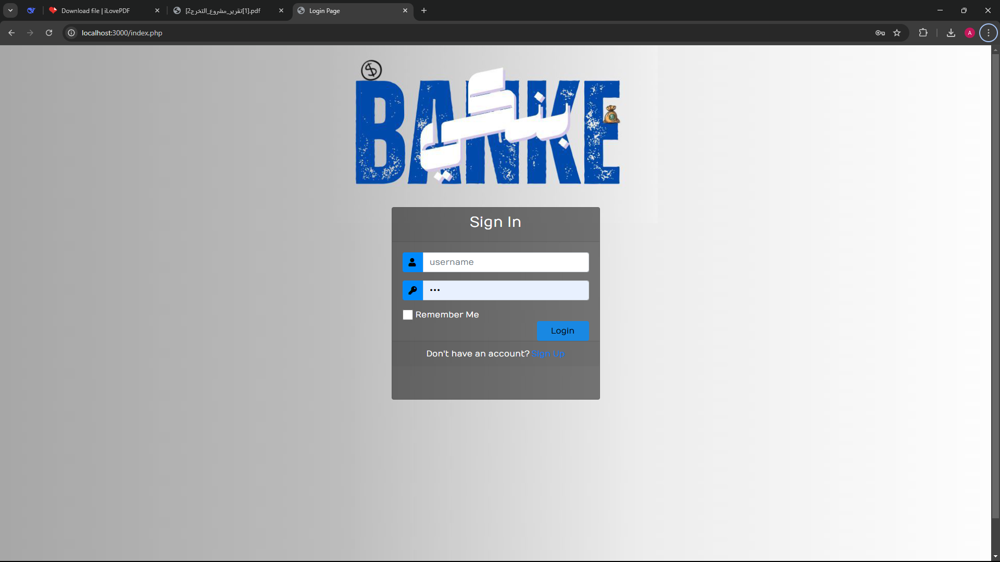
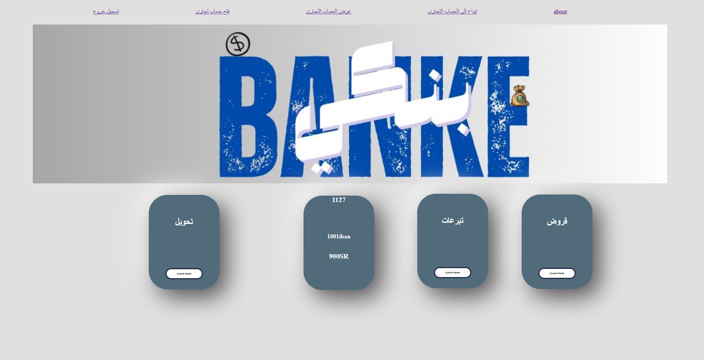

# 🏦 Banking System Project | مشروع نظام بنكي

نظام ويب لإدارة العمليات المصرفية تم تطويره باستخدام PHP و MySQL  
كجزء من مشروع التخرج من الكلية التقنية.

---

## 📌 فكرة المشروع | Project Idea

نظام يتيح للمستخدم:
- إنشاء حساب جديد
- تسجيل الدخول
- عرض الرصيد
- التحويل بين الحسابات
- فتح حساب ادخار
- التبرعات
- طلب قرض
- إدارة الحسابات من لوحة تحكم المشرف

---

## ⚙️ التقنيات المستخدمة | Technologies Used

- 💻 PHP, HTML, CSS
- 🗃️ MySQL
- 🧰 XAMPP, NetBeans
- 🧱 Draw.io, Microsoft Access

---

## 🛠️ طريقة التشغيل | How to Run

1. استيراد قاعدة البيانات من مجلد `sql` إلى phpMyAdmin
2. تعديل معلومات الاتصال بقاعدة البيانات داخل ملف `config.php`
3. تشغيل المشروع على خادم محلي مثل XAMPP

---

## 🖼️ صور من المشروع | Project Screenshots

### 🔐 صفحة تسجيل الدخول:
  

### 🏠 الصفحة الرئيسية بعد الدخول:

### 💸 صفحة العمليات والتحويل:

---

## 📄 عرض المشروع | Portfolio PDF

📎 [اضغط هنا لعرض البورتفوليو](Portfolio.pdf)

---

## 📬 للتواصل | Contact

- 📧 ahmsul61@gmail.com  
- 📱 0562173630

---

## 📝 الرخصة | License

هذا المشروع متاح تحت رخصة MIT للاستخدام المفتوح.
